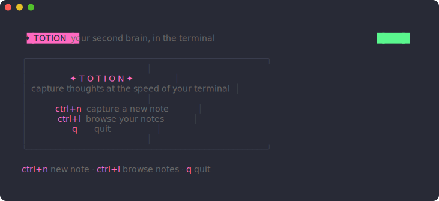
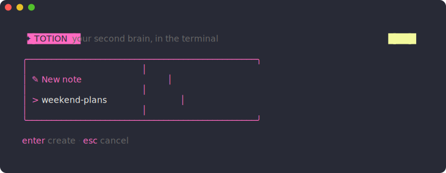
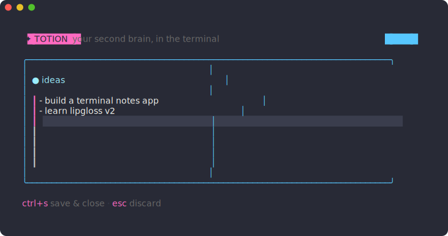
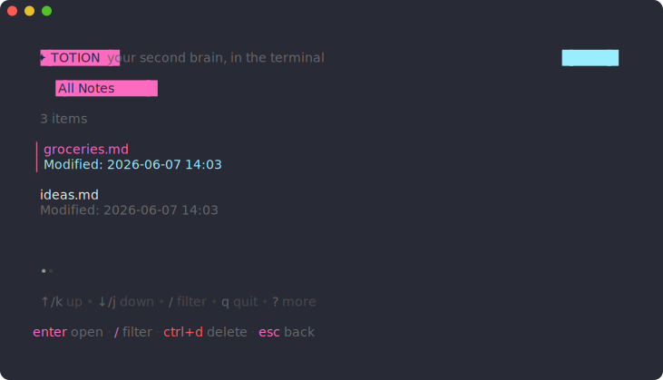

<div align="center">

# ✦ Totion

**Your second brain, in the terminal.**

A fast, keyboard-driven notes app built with [Bubble Tea](https://github.com/charmbracelet/bubbletea),
dressed in the [Snazzy](https://github.com/sindresorhus/hyper-snazzy) color theme.



</div>

## Features

- 📝 **Instant capture** — `ctrl+n`, type a name, start writing
- 🗂 **Browse & filter** — fuzzy-filter your notes with `/`
- 💾 **Plain Markdown** — every note is a `.md` file in `~/.totion`, no lock-in
- 🎨 **Snazzy theme** — true-color UI with per-screen mode pills and framed panels
- ⌨️ **100% keyboard** — no mouse required, ever

## Screens

### Create a note

Hit `ctrl+n` and name your thought:



### Write

The editor opens in a blue-framed panel titled with your note's name:



### Browse

`ctrl+l` lists every note in your vault — filter with `/`, open with `enter`:



## Install

Requires Go 1.24+.

```sh
git clone https://github.com/milankatira/totion.git
cd totion
make build   # builds ./totion
make run     # builds and launches
```

Or run straight from source:

```sh
make dev
```

## Keybindings

| Key      | Action                                  |
| -------- | --------------------------------------- |
| `ctrl+n` | Create a new note                        |
| `ctrl+l` | Browse all notes                         |
| `enter`  | Create the note / open the selected note |
| `ctrl+s` | Save the open note and close the editor  |
| `ctrl+d` | Delete the selected note (in the list)   |
| `/`      | Filter the notes list                    |
| `esc`    | Go back / cancel                         |
| `q`      | Quit (from the home screen)              |
| `ctrl+c` | Quit from anywhere                       |

## Vault

Notes live as plain Markdown files in `~/.totion`. Back them up, sync them,
grep them — they're just files.

## Theme

Totion uses the Snazzy palette throughout:

| Color   | Hex       | Used for                          |
| ------- | --------- | --------------------------------- |
| Pink    | `#ff6ac1` | Logo, selection, keys, cursor     |
| Blue    | `#57c7ff` | Editor frame, `EDIT` mode pill    |
| Cyan    | `#9aedfe` | Panel titles, `NOTES` mode pill   |
| Green   | `#5af78e` | `HOME` mode pill                  |
| Yellow  | `#f3f99d` | `NEW` mode pill, filter matches   |
| Red     | `#ff5c57` | Destructive actions (`ctrl+d`)    |
| Fg      | `#eff0eb` | Body text                         |

The app inherits your terminal's own background color, so it blends into
whatever theme you already run.

All colors and component styles live in [`theme.go`](theme.go).

## Development

```sh
make dev       # run from source
make build     # compile ./totion
go test ./...  # run tests
```

## Built with

- [Bubble Tea v2](https://github.com/charmbracelet/bubbletea) — TUI framework
- [Bubbles v2](https://github.com/charmbracelet/bubbles) — list, textarea, and input components
- [Lip Gloss v2](https://github.com/charmbracelet/lipgloss) — styling
